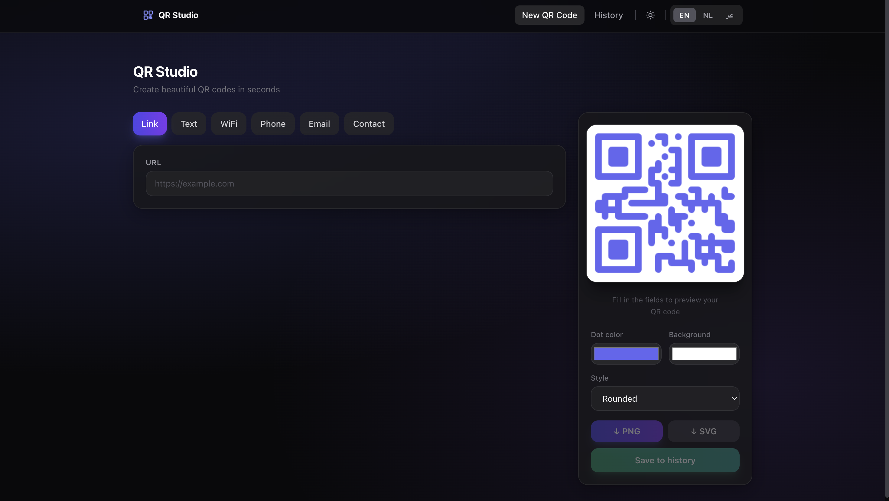
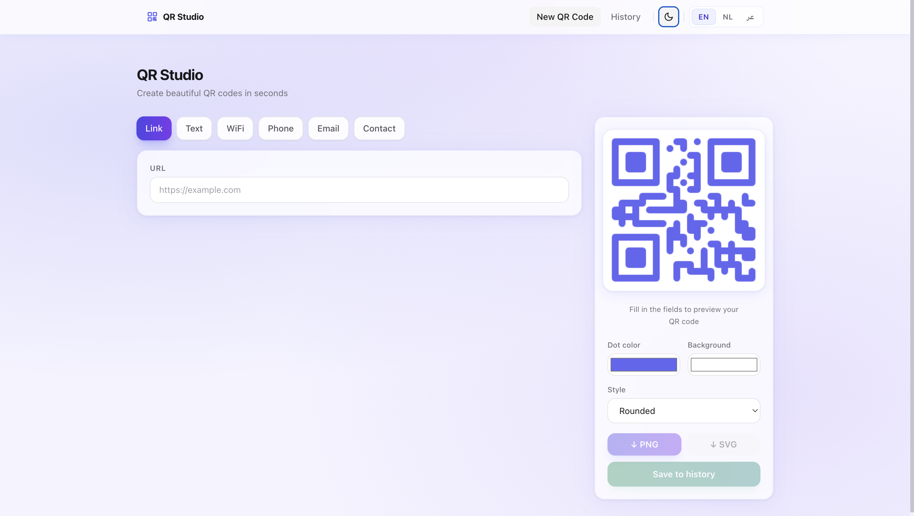

# QR Studio

A full-featured QR code generator — supports links, plain text, Wi-Fi networks, phone numbers, e-mail addresses, and vCards (contact cards). Customize colors and dot style, download as PNG or SVG, and save a history of every QR code you create.

<p align="center">
  
  
</p>

## Features

- **6 content types:** Link, Text, Wi-Fi, Phone, E-mail, Contact (vCard)
- **Custom styling:** dot color, background color, and dot shape (Square / Dots / Rounded / Classy)
- **Live preview** — updates instantly as you type
- **Download** as PNG or SVG
- **History dashboard** at `/history` — all saved codes are stored in a database; view or delete them any time
- **Light & dark mode** with system-preference detection and localStorage persistence
- **Internationalization:** English, Dutch, and Arabic (including full RTL layout)
- **Docker-ready** for effortless deployment

## Tech stack

- [Next.js 14](https://nextjs.org/) (App Router)
- [Tailwind CSS](https://tailwindcss.com/)
- [qr-code-styling](https://github.com/kozakdenys/qr-code-styling)
- [Prisma](https://www.prisma.io/) + [SQLite](https://www.sqlite.org/)
- [Docker](https://www.docker.com/) + Docker Compose

---

## Option A: Run with Docker (recommended)

This is the easiest path — you only need Docker, no local Node.js installation required.

### Prerequisites
- [Docker Desktop](https://www.docker.com/products/docker-desktop/) (includes Docker Compose)

### Start

```bash
cd qr-generator
docker compose up --build
```

Then open: **http://localhost:3000**

On first start:
- The Docker image is built (takes a few minutes)
- The SQLite database is created automatically inside a Docker volume
- Data in that volume **persists** across container restarts

### Stop

```bash
docker compose down
```

Your QR history is preserved — `down` does not remove volumes.

### Stop and delete all data

```bash
docker compose down -v
```

### Restart a running container

```bash
docker compose restart
```

### View logs

```bash
docker compose logs -f
```

---

## Option B: Run locally without Docker (Node.js)

### Prerequisites
- Node.js 18 or higher ([download](https://nodejs.org/))

### Steps

```bash
# 1. Go to the project directory
cd qr-generator

# 2. Create the environment file (for local SQLite)
cp .env.example .env

# 3. Install dependencies
npm install

# 4. Create / sync the database
npx prisma db push

# 5. Start the dev server
npm run dev
```

Open: **http://localhost:3000**

### Other useful commands

```bash
npm run build        # create a production build
npm run start        # serve the production build
npx prisma studio    # open a graphical database browser
```

---

## Pushing to GitHub

### a. Configure Git (one-time setup)

```bash
git config --global user.name "Your Name"
git config --global user.email "you@example.com"
```

### b. Initialize the repository

```bash
cd qr-generator
git init
git add .
git commit -m "Initial commit: QR Studio"
git branch -M main
```

### c. Create a repository on GitHub

1. Go to [github.com/new](https://github.com/new)
2. Give it a name (e.g. `qr-generator`)
3. **Do not** check "Add a README file" (we already have one)
4. Click **Create repository**
5. Copy the URL shown, e.g. `https://github.com/USERNAME/qr-generator.git`

### d. Push

```bash
git remote add origin https://github.com/USERNAME/qr-generator.git
git push -u origin main
```

### Pushing subsequent changes

```bash
git add .
git commit -m "describe your change"
git push
```

---

## How the database / history works

- Every time you click **"Save to history"** in the preview panel, the QR code is written to a SQLite database (a plain file — no separate database server needed).
- The `/history` page (top-right "History" button) lists everything you have saved. You can delete individual entries there.
- **With Docker:** the database lives in the `qr-data` Docker volume and survives container restarts.
- **Without Docker:** the database file is `prisma/dev.db` on your local disk.

---

## Project structure

```
qr-generator/
├── app/
│   ├── layout.js               # root layout (font, theme anti-flash script)
│   ├── page.js                 # home page — QR generator
│   ├── globals.css             # global styles + Tailwind
│   ├── history/
│   │   └── page.js             # history dashboard
│   └── api/
│       └── qrcodes/
│           ├── route.js        # GET (list) + POST (save)
│           └── [id]/route.js   # DELETE (remove)
├── components/
│   ├── Header.js               # sticky header with nav, theme toggle, language switcher
│   ├── ThemeToggle.js          # sun/moon button for light/dark mode
│   ├── LanguageProvider.js     # locale + theme state, localStorage persistence
│   ├── LanguageSwitcher.js     # EN / NL / AR pill switcher
│   ├── ContentTypeSelector.js  # content-type pill buttons
│   ├── DynamicFields.js        # form fields that change per content type
│   ├── QrPreview.js            # live preview + customization + download/save
│   └── QrThumbnail.js          # small read-only QR for the history list
├── lib/
│   ├── i18n.js                 # translations (en / nl / ar) + locale context
│   ├── qrFormatters.js         # converts form input to correct QR data strings
│   └── prisma.js               # Prisma client singleton
├── prisma/
│   └── schema.prisma           # database schema (QrCode table)
├── Dockerfile                  # multi-stage production image
├── docker-compose.yml          # app + persistent data volume
├── docker-entrypoint.sh        # syncs database on container startup
├── .env.example                # example environment variables
├── package.json
├── tailwind.config.js
└── next.config.js
```

## Ideas for future extensions

- [ ] Embed a logo in the center of the QR code
- [ ] Search / filter history by type or date
- [ ] QR code for Bitcoin / crypto addresses
- [ ] Authentication (for sharing the app with multiple users)
